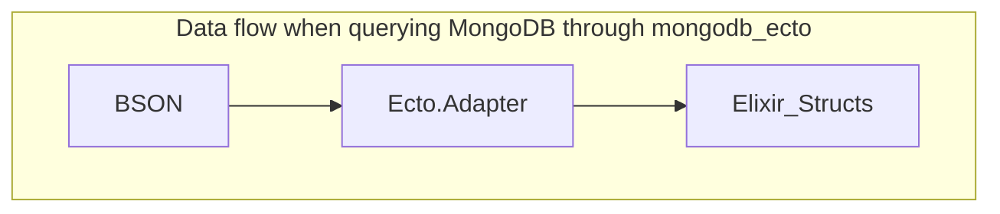

# EctoBox

Use [Ecto](https://github.com/elixir-ecto/ecto) to turn your JSON payload into deeply-nested Elixir structs. 
Inspired by this [Box](https://gist.github.com/teamon/b90a2ddca4965848559a96aff49ed9bb) snippet. 

`TL;DR:` see [live example](./ecto_box.livemd)

## What's in the box?

The library provides two modules:
* `EctoBox` - to define schemas
* `EctoBox.HttpResponseMapper` - a reference implementation suitable for converting responses of `Req` and `Tesla` into Elixir schemas. It's tiny and you can easily adjust it to your needs. 

## Philosophy

There are [great](https://craft.mirego.com/2020-12-20-params-map-ecto-changeset) [examples](https://gist.github.com/char0n/6fca76e886a2cfbd3aaa05526f287728) of using `Changeset` to validate JSON payloads and convert them into nested structs. But there's also an old thread on Elixir Forum asking if it's an [Overkill to use Ecto Schema to map external JSON to structs?](https://elixirforum.com/t/overkill-to-use-ecto-schema-to-map-external-json-to-structs/2906/14). 

In fact, Ecto is a double-edged sword capable of mapping both the **user's input** and the **DB representation** into Elixir structs. 

For example, [mongodb_ecto](https://github.com/elixir-mongo/mongodb_ecto) implements [Ecto.Adapter](https://hexdocs.pm/ecto/Ecto.Adapter.html) behaviour to map BSON to nested Elixir structs:




But the true magic of Ecto's recursive data conversion lives in the `Ecto.Repo.Schema.load` call.
Can we make this light-weight Ecto magic available for use with `Tesla` or `Req` HTTP libraries? After all, external APIs returning JSON are not that much different from Mongo DB server returning BSON.

## Installation

If [available in Hex](https://hex.pm/docs/publish), the package can be installed
by adding `ecto_box` to your list of dependencies in `mix.exs`:

```elixir
def deps do
  [
    {:ecto_box, "~> 0.1.0"}
  ]
end
```

Documentation can be generated with [ExDoc](https://github.com/elixir-lang/ex_doc)
and published on [HexDocs](https://hexdocs.pm). Once published, the docs can
be found at <https://hexdocs.pm/ecto_box>.


## Acknowledgments

Thanks to the [contributors](https://github.com/elixir-mongo/mongodb_ecto/graphs/contributors) of [mongodb_ecto](https://github.com/elixir-mongo/mongodb_ecto) repository and [@teamon](https://gist.github.com/teamon). EctoBox is largely based on their ideas and code snippets.

## Contributing

Please use Github Issues for bug reports and to discuss the improvement proposals.